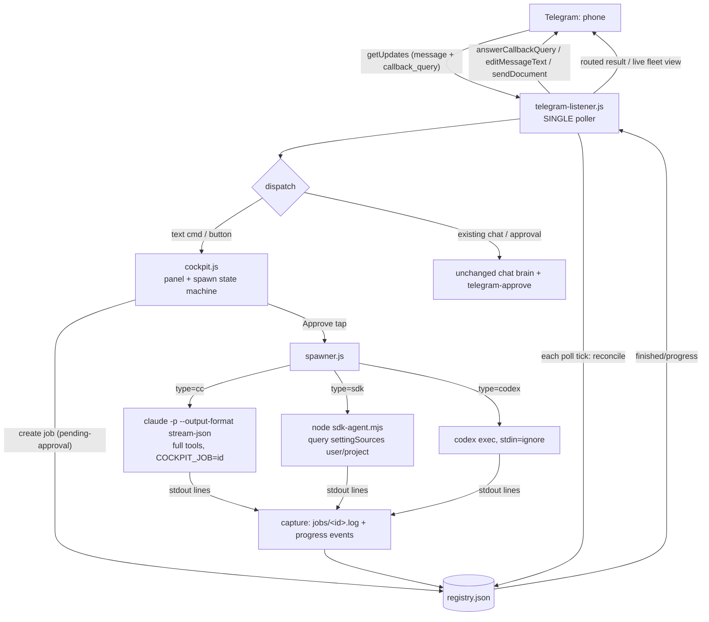
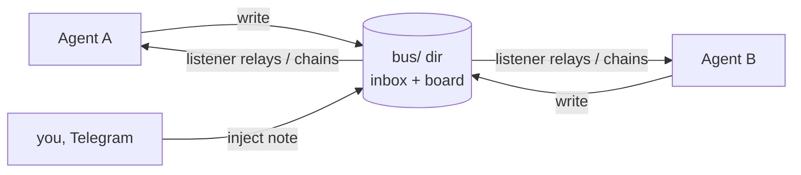

# Telegram Cockpit — Mobile Mission-Control for an AI Agent Fleet

## Context

You already run an always-on Telegram long-poller (`~/.claude/hooks/telegram-listener.js`)
that lets you drive a single locked-down "chat brain" (`claude -p --tools ""`) and
approve its tool calls from your phone. This plan turns that one-brain chat into a
**control panel**: from Telegram you spawn and watch a *fleet* of full-power agents
(CC instances, Claude Agent SDK agents, Codex runs), single or in parallel, see their
output as terminal-style monospace blocks, and approve/kill them with tappable buttons.

The goal is mission-control, not chat: launch → watch live → approve/kill, all from the couch.

> **Repo note:** The cockpit's source lives on your local Windows machine
> (`~/.claude/hooks/` + `channels/telegram/`), which is **not** present in this repo
> (this repo is the Lucac React app). This document is the approved plan; the actual
> `.js`/`.mjs` drops happen locally, where the listener and your Claude Max login exist.
> Every file path below is relative to your local `~/.claude/` tree unless noted.

## Hard constraints honored
- **Single-poller rule.** No second `getUpdates` loop (avoids 409). ALL new behavior —
  `callback_query` handling, progress pushes, reconcile — hangs off the existing listener loop.
- **Chat brain stays — fully.** The locked chat brain (`--tools ""`) keeps working exactly as
  today. The cockpit is purely additive: a normal text message always goes to chat. The ONLY
  exception is the brief window after you tap "Spawn X" — the *next* message is captured as that
  job's task (`cockpit.onText` returns `true` to claim it); the moment that's consumed (or you
  cancel), messages fall straight through to chat again. Chat is never disabled or intercepted
  outside that one captured turn. Full power is granted ONLY to spawned work-agents, ONLY after a
  tap on the approval gate.
- **Dependency-free + free.** Native `child_process`, `fs`, `https`. No npm adds except the
  Claude Agent SDK (already installed for the SDK-agent path; verify locally).
- **Single-user.** Allowlist (chat `8157676812`) is re-checked on every `callback_query`, not just messages.
- **Don't break what works.** Existing chat/approve/notify/schedule flows are untouched except
  two additive edits (listener loop + a 2-line guard in `telegram-approve.js`).

---

## Architecture



**Why child handles live in the listener:** the listener already runs forever. It `spawn`s each
agent and keeps the `ChildProcess` in an in-memory `Map<jobId, child>`, attaches `stdout`/`exit`
listeners directly, and drives throttled Telegram edits. `registry.json` persists
(id/type/task/status/pid/paths/message_id) purely for the Status view and crash recovery — the
listener is the only process that mutates it (atomic temp-write + rename), so no lock contention.

---

## Job registry shape

`channels/telegram/jobs/registry.json` — `{ jobs: { <id>: Job } }`. One log file per job at
`channels/telegram/jobs/<id>.log` (raw stdout+stderr).

```jsonc
{
  "id": "a1b2c3",            // 6-char base36, short enough for 64-byte callback_data
  "type": "cc",             // "cc" | "sdk" | "codex"
  "task": "fix the budget donut rounding bug",
  "status": "running",      // queued | pending-approval | running | done | failed | killed | orphaned
  "pid": 48213,
  "cwd": "C:/path/to/target/repo",
  "model": "sonnet",
  "logPath": "channels/telegram/jobs/a1b2c3.log",
  "msgId": 9912,             // Telegram message_id of this job's status card (for editMessageText)
  "progress": "editing src/BudgetTab.jsx",
  "startedAt": 1730000000000,
  "finishedAt": null,
  "exitCode": null,
  "resultRouted": false
}
```

Helpers in `registry.js`: `load()`, `save(reg)` (atomic), `create(partial)`, `update(id,patch)`,
`runningCount()`, `byStatus(s)`, `nextQueued()`. The in-memory `children` Map is NOT persisted.

---

## File-by-file changes

### NEW `channels/telegram/cockpit/registry.js`
Pure registry CRUD as above. Atomic save = write `registry.json.tmp` then `fs.renameSync`.

### NEW `channels/telegram/cockpit/spawner.js`
`spawnJob(job, { onProgress, onExit })` → builds command per type, spawns with `cwd`, env
`{ ...process.env, COCKPIT_JOB: job.id }`, redirects stdout/stderr to an `fs.createWriteStream`
on `logPath` AND feeds lines to a parser → `onProgress(text)`; on `exit` → `onExit(code)`.
Returns the `ChildProcess` (caller stores it in the `children` Map).

Command builders (Windows, `shell:false`, resolve binary paths explicitly because the
VBS-launched listener has a thin PATH):
- **buildCC(task, cwd):** `claude -p --output-format stream-json --verbose --model sonnet
  --permission-mode bypassPermissions --add-dir <cwd>`; task written to **stdin** then end stdin
  (avoids Windows arg-escaping). NOT `--tools ""` → full tools + auto-loaded skills.
  `--verbose` is mandatory with `stream-json` under `-p`.
- **buildCodex(task):** `codex exec` with task on argv; **`stdio: ['ignore', pipe, pipe]`** — the
  ignored stdin gives an immediate EOF, the clean Node equivalent of the `< /dev/null` gotcha.
- **buildSDK(task, cwd):** `node channels/telegram/cockpit/sdk-agent.mjs`; task JSON on stdin.

Progress parsing:
- **cc:** each stdout line is a stream-json event. Surface `assistant` text snippets and
  tool-use names as `progress`; the terminal `result` event marks completion (capture its text).
- **sdk:** our wrapper's own line protocol (below): `{type:"progress",text}` / `{type:"result",ok,text}`.
- **codex:** no structured stream → `progress` = last non-empty stdout line; `exit code` = done.

### NEW `channels/telegram/cockpit/sdk-agent.mjs`  ← the SDK-skills answer
A thin Node wrapper around the Claude Agent SDK that loads the **same skill catalog CC uses**.
Reads task from stdin, then:

```js
import { query } from "@anthropic-ai/claude-agent-sdk";
for await (const msg of query({
  prompt: task,
  options: {
    model: "claude-sonnet-4-6",
    settingSources: ["user", "project"],          // ← loads ~/.claude/skills + project .claude/skills, CLAUDE.md, slash cmds
    systemPrompt: { type: "preset", preset: "claude_code" }, // ← full CC system prompt incl. Skill tool wiring
    permissionMode: "bypassPermissions",           // full power, behind the spawn gate
    cwd: process.cwd(),
    // no allowedTools restriction = full tool set, including the Skill tool
  },
})) {
  // translate SDK stream messages -> our line protocol on stdout
  if (msg.type === "assistant") emit({ type: "progress", text: firstText(msg) });
  if (msg.type === "result")    emit({ type: "result", ok: !msg.is_error, text: msg.result });
}
```

**The mechanism:** skills are filesystem `SKILL.md` dirs that CC auto-discovers. The Agent SDK is
the same engine but, by default (recent versions), loads **no** filesystem settings. Setting
`settingSources: ["user","project"]` makes it discover `~/.claude/skills/` and `.claude/skills/`
exactly like CC; the `claude_code` system-prompt preset + an unrestricted tool set ensure the
`Skill` tool is present so those skills are invocable. That parity is the whole trick.

> **Verify locally (MEDIUM confidence on exact option names):** `settingSources`,
> `systemPrompt: {type:"preset",preset:"claude_code"}`, and `permissionMode` are correct for the
> current Claude Agent SDK, but confirm against the installed version
> (`npm ls @anthropic-ai/claude-agent-sdk`) and the docs before shipping — the SDK was renamed
> from "Claude Code SDK" and these defaults changed across versions.

### NEW `channels/telegram/cockpit/ui.js`
Telegram render helpers (no I/O):
- `panel()` → main control-panel `inline_keyboard`: `[Spawn CC][Spawn SDK][Spawn Codex]`,
  `[Fleet/Refresh][Kill…]`. callback_data is compact: `sp:cc`, `sp:sdk`, `sp:cdx`, `fleet`,
  `kill:<id>`, `appr:<id>`, `can:<id>`, `log:<id>`.
- `fleetView(reg)` → monospace `<pre>` table (HTML parse_mode), e.g.
  ```
  FLEET  2/3 running
  [a1b2] cc   run   12s  editing BudgetTab.jsx
  [c3d4] sdk  run    4s  reading skills
  [e5f6] cdx  done  45s  ✓
  ```
  plus per-running-job Kill buttons.
- `jobCard(job)` and `confirmCard(job)` (Approve/Cancel buttons for the gate).
- `esc(s)` HTML-escape (`& < >`), `tail(text, lines, maxChars)` to respect Telegram's 4096 limit,
  `enc/dec` for callback_data.

### NEW `channels/telegram/cockpit/telegram-io.js`  (or extend the listener's existing send fn)
Wrap Bot API with a **global rate limiter** (serial queue, ≥1100 ms between calls; dedupe
identical edits) to stay under Telegram's ~1 msg/s-per-chat limit when many agents report at once:
`sendMessage`, `editMessageText`, `answerCallbackQuery` (always called on every callback to clear
the spinner), `sendDocument` (for full logs that exceed the message cap). Reuse the existing token
load from `channels/telegram/.env`.

### NEW `channels/telegram/cockpit/cockpit.js`
The brain of the panel, called by the listener:
- `showPanel(chatId)` — posts the control panel.
- `onText(chatId, text)` — if a per-chat spawn state is `awaiting-task:<type>`, this text becomes
  the job task → `create` job as `pending-approval` → post `confirmCard`. Returns `true` if it
  consumed the message (so the listener doesn't also hand it to the chat brain).
- `onCallback(cbq)` — dispatch by callback_data prefix: `sp:*` sets awaiting-task state + prompts;
  `appr:<id>` → enforce cap, set `running`, call `spawner.spawnJob`, store child + `msgId`;
  `can:<id>` → drop job; `kill:<id>` → kill; `fleet` → edit fleet view; `log:<id>` → `sendDocument`.
- `reconcile()` — called every poll tick: start `queued` jobs if `runningCount < maxConcurrent`;
  route finished jobs (`resultRouted` flag, tail+`sendDocument`); detect dead pids
  (`running` with no live child) → `orphaned` + notify; push throttled progress edits
  (per-job ≥5 s, via the rate limiter).
- `killJob(id)` — `child.kill()` if handle present, else Windows `taskkill /PID <pid> /T /F`
  (`/T` reaps the child tree — `claude`/`codex` spawn subprocesses). Mark `killed`, notify.

### EDIT `~/.claude/hooks/telegram-listener.js`  (additive, ~30 lines)
1. `getUpdates` params: add `allowed_updates: ["message","callback_query"]`.
2. In the update loop: if `update.callback_query` → re-check `from.id` against allowlist →
   `cockpit.onCallback(cbq)` → `answerCallbackQuery`. Else for `message`: first
   `if (cockpit.onText(chatId, text)) continue;` (lets the spawn state machine claim task text),
   otherwise fall through to the **unchanged** chat-brain path. Add a `/cockpit` (or `/fleet`)
   command → `cockpit.showPanel`.
3. After processing the batch each tick: `cockpit.reconcile()`.

### EDIT `~/.claude/hooks/telegram-approve.js`  (2 lines, critical)
At the very top: `if (process.env.COCKPIT_JOB) process.exit(0); // work-agents run unattended`.
Without this, a spawned CC agent (which inherits your PreToolUse hook) would fire a phone-approval
request on **every tool call** — spamming you and deadlocking the unattended job. The spawn-time
button IS the gate; per-tool approval is only for the interactive chat brain.

### NEW `channels/telegram/cockpit/config.json`
`{ "maxConcurrent": 3, "model": "sonnet", "progressThrottleMs": 5000, "logTailLines": 40, "logTailChars": 3500 }`

---

## Inter-agent communication — a file bus brokered by the listener (NOT tmux)

tmux is a Unix TTY multiplexer for *interactive* panes; these agents are headless Windows
processes with no TTY, so tmux is the wrong tool. Instead the listener — which already holds every
child handle and is the single writer of shared state — acts as a **message broker** over a
file bus, mirroring your existing registry/approvals-dir pattern. Dependency-free. Tiered:



**Tier 1 — Result handoff / chaining (v1).** A job can declare `then: <jobId|spec>`. When it exits
`done`, `cockpit.reconcile()` feeds its result text into the successor job's task (or unblocks a
`queued` fan-in job once all its `dependsOn` ids finish). Pure registry fields
(`dependsOn: [], then: null`) + reconcile logic — no new transport. Enables pipelines
(plan → implement → review) and fan-in (3 racers → 1 judge agent).

**Tier 2 — Shared scratchpad (v1).** `channels/telegram/jobs/<runId>/board.md` (and per-agent
`inbox/<jobId>.jsonl`). Spawned agents get a tiny `bus` CLI helper
(`node cockpit/bus.js post|read <jobId> <text>`) added to their `cwd` so they can drop/read notes
via the Bash tool. The listener tails the board and mirrors new entries to Telegram so you watch
the cross-talk live. One-shot agents append on their single pass; good for shared findings/TODOs.

**Tier 3 — Live multi-turn dialogue (documented v2).** Real back-and-forth needs *persistent*
sessions, which one-shot `-p`/`codex exec` can't do. Two routes, both broker-relayed by the
listener: (a) **CC** `--resume <session_id>` — capture each agent's session id from its stream,
and on a new inbox message re-invoke `claude --resume <id> -p "<incoming>"` to continue that exact
context; (b) **SDK** persistent session — `sdk-agent.mjs` accepts a *streaming* async-iterable
prompt and stays open, so the listener pushes peer messages in as new turns and streams replies
out. The broker enforces turn-taking (round cap) and routes every turn through the bus so you see
the debate in Telegram and can `Kill` it. Confidence: MEDIUM on exact SDK streaming-input + resume
ergonomics — verify against the installed SDK/CLI before building Tier 3.

Registry additions for this: `runId` (groups a fleet), `dependsOn: []`, `then`, `sessionId`,
`inboxPath`. New file `channels/telegram/cockpit/bus.js` (post/read + board append, atomic writes).

---

## Build phases

- **Phase 1 — Registry + spawner core (no Telegram).** `registry.js`, `spawner.js`, `config.json`.
  Verify by spawning a CC job from a throwaway Node script, watching `jobs/<id>.log` fill and the
  registry flip to `done`.
- **Phase 2 — SDK-skills parity.** `sdk-agent.mjs`. Verify a spawned SDK agent actually invokes a
  skill (give it a task that needs one, confirm in the log) — this de-risks the riskiest unknown early.
- **Phase 3 — Telegram UI + callbacks.** `ui.js`, `telegram-io.js`, `cockpit.js`; wire the two
  listener edits + the approve-hook guard. Verify the panel, spawn-with-approval, live fleet edits,
  kill, and full-log document all from your phone.
- **Phase 4 — Parallel + hardening.** Concurrency cap + queue, crash-recovery reconcile on listener
  restart, rate-limiter under load, codex/cc/sdk all green in parallel.
- **Phase 5 — Inter-agent bus (Tier 1 + 2).** `bus.js`, registry `runId`/`dependsOn`/`then`/`inbox`,
  reconcile handoff/fan-in, shared `board.md` mirrored to Telegram. Verify a 2-stage chain and a
  3→1 fan-in. (Tier 3 live dialogue deferred to a documented v2.)

## Verification (end-to-end, from the phone)
1. `/cockpit` → panel renders with buttons.
2. Spawn CC → confirm card → Approve → job card appears, fleet view edits live, final result routes
   back; `log:<id>` returns the full file as a document.
3. Spawn 3 of mixed type at once → 3rd queues if `maxConcurrent:3` is hit by a 4th; Kill one → it
   dies (verify no orphaned `claude.exe` via `tasklist`).
4. Confirm chat brain still answers normally and still `--tools ""` (lockdown intact); confirm a
   spawned CC agent does NOT trigger per-tool phone approvals (COCKPIT_JOB guard working).
5. Restart the listener mid-run → reconcile marks the live job correctly / orphans cleanly, no 409.

---

## Risk & safety
- **Fleet runaway / API exhaustion:** `maxConcurrent` cap + queue; Claude Max rate limits respected
  by limiting parallelism.
- **No agent without consent:** every spawn passes the Approve/Cancel button gate before `running`.
- **Lockdown preserved:** chat brain unchanged (`--tools ""`); full power is spawn-gated and scoped
  to work-agents only.
- **Approval-hook deadlock:** `COCKPIT_JOB` guard in `telegram-approve.js` prevents per-tool prompt
  spam in unattended agents.
- **Zombie processes:** kill uses `taskkill /T` to reap the whole child tree.
- **Single-poller:** zero new pollers → no 409. All Telegram reads stay in the listener loop.
- **Callback auth:** re-check `callback_query.from.id` against the allowlist (callbacks are a new
  ingress path, not just messages).
- **Message limits / flooding:** tail+truncate to ≤3500 chars, full log via `sendDocument`, global
  serial rate limiter with edit-dedupe.
- **Registry corruption:** single-writer (listener) + atomic temp-rename; reconcile heals stale state.
- **Secret hygiene:** bot token stays in `.env`; spawned agents auth via your existing Claude Max
  CLI login, not by passing keys around. Don't echo env into logs.
- **Windows PATH:** resolve `claude`/`codex`/`node` to absolute paths in `spawner.js` (the
  VBS-hidden listener has a minimal environment).

---

## Bonus — 3 top-tier use cases (specific to this rig)
1. **Model race / fan-out.** One tap spawns the *same* task to CC **and** Codex **and** an SDK
   agent in parallel; the fleet view shows all three; when they finish you get three result cards
   and a `[Pick a1b2]` button that promotes the winner's working dir to a branch/PR. Turns "which
   tool nails this bug?" into a 30-second couch decision.
2. **Repo backlog swarm.** `/swarm` pulls open issues/PRs for `poppadoccs/lucac-life-app` via the
   GitHub MCP/`gh`, spawns one capped batch of work-agents (one per issue, each with full skills),
   and each posts a proposed fix + diff with an Approve-to-PR button. Phone-driven mission control
   over your whole backlog.
3. **Self-healing nightly.** A `schtasks` job (reusing your existing scheduler) runs a CC agent
   nightly against lucac-life-app (`npm run build` + smoke checks). On failure it auto-spawns a fix
   agent **as a queued cockpit job** and pings you with the failure tail + diff and an Approve
   button — the fleet quietly fixes itself overnight and you rubber-stamp it with coffee.
